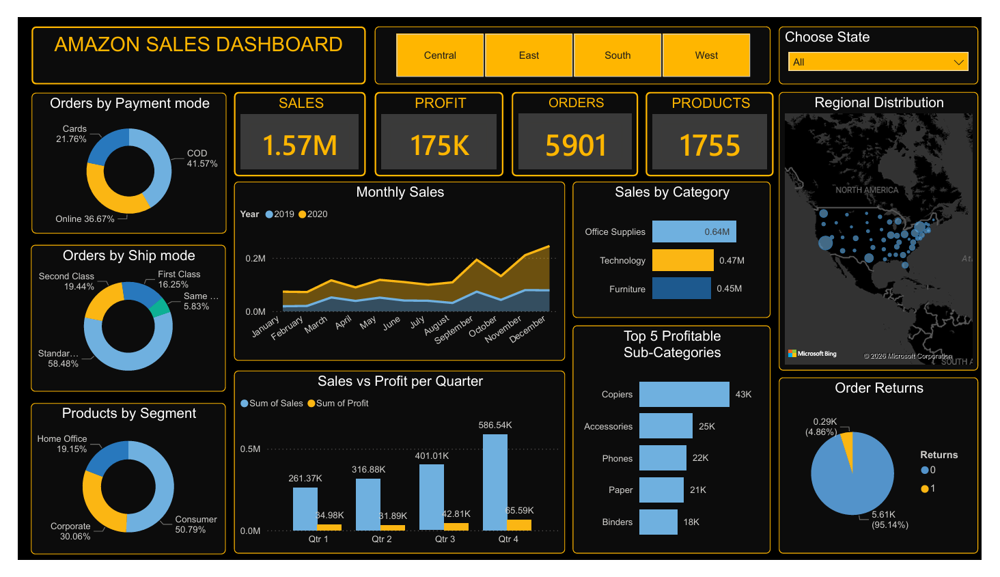

# Amazon Sales Dashboard - Power BI

## Project Overview
This Power BI dashboard analyzes Amazon sales performance and provides business insights on sales, profit, orders, products, customer segments, payment modes, and shipping methods.

## Key Insights
- Total Sales: 1.57M
- Total Profit: 175K
- Total Orders: 5901
- Products Sold: 1755

## Dashboard Features
- Sales by Category
- Monthly Sales Trend
- Sales vs Profit Analysis
- Regional Distribution
- Order Returns Analysis
- Payment Mode Analysis
- Ship Mode Insights
- Customer Segment Breakdown

## Tools Used
- Power BI
- Excel/CSV Dataset
- Data Cleaning
- Data Visualization

## Business Questions Solved
1. Which category generates the highest sales?
2. Which sub-category is most profitable?
3. What payment mode is most used?
4. Which quarter generates maximum profit?
5. How do sales vary by region?

## Dashboard Preview

## Author
Bhumit Kalal
Aspiring Data Analyst

📧 Email: bhumitkalal@gmail.com  
🔗 LinkedIn: linkedin.com/in/bhumitkalal  
💻 GitHub: github.com/Bhumitkalal
